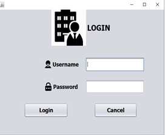
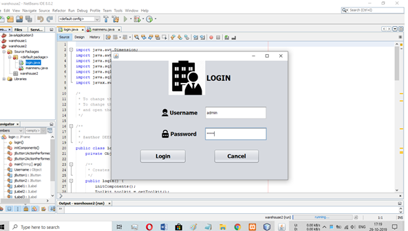
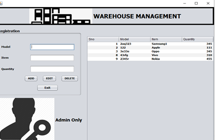
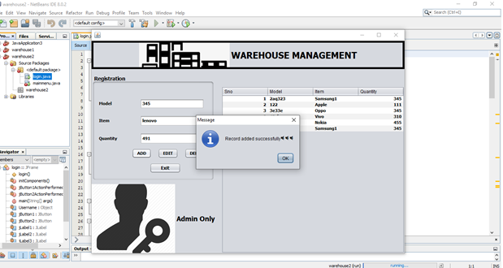
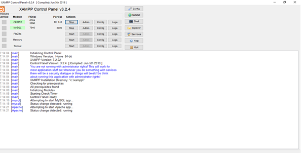
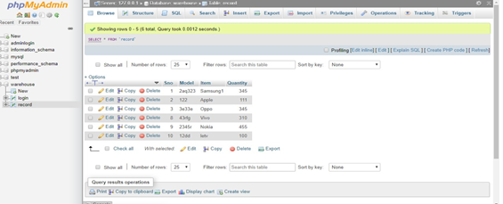

# About warehouse management
The Warehouse Management System is a real-time warehouse database capable of handling large inventories of an organization. This can be used to track the inventory of a single store, or to manage the distribution of stock between several stores of a larger franchise. However, the system merely records sales and restocking data and provides notification of low stock at any location at a specified interval. The goal is to reduce the strain of tracking rather than to handle all store maintenance. The main goal of Warehouse Management System is to ensure consistent availability of supplies for consumers. Thus, Warehouse Management System is directed toward owners of small to large stores and stock managers who are responsible of maintaining sufficient goods on hand in a retail or manufacturing business. It can scale from a single computer running both client and server software up to multiple stores and warehouses.The system is also capable of tracking In & Out transaction of single or multiple stores as well as also generates their billing details. The system generates monthly reports of sales from which a manager of a respective store would be able to know the monthly sales transaction done. Warehouse Management system is a Desktop application. 
# Technology used is Java & MySql
Java is a general-purpose programming language that is class-based, object-oriented, and designed to have as few implementation dependencies as possible. It is intended to let application developers write once, run anywhere (WORA), meaning that compiled Java code can run on all platforms that support Java without the need for recompilation. Java applications are typically compiled to bytecode that can run on any Java virtual machine (JVM) regardless of the underlying computer architecture. The syntax of Java is similar to C and C++, but it has fewer low-level facilities than either of them. As of 2019, Java was one of the most popular programming languages in use according to GitHub, particularly for client-server web applications, with a reported 9 million developers. 

MySQL is free and open-source software under the terms of the GNU General Public License, and is also available under a variety of proprietary licenses. MySQL was owned and sponsored by the Swedish company MySQL AB, which was bought by Sun Microsystems (now Oracle Corporation). In 2010, when Oracle acquired Sun, Widenius forked the open-source MySQL project to create MariaDB. 

Frontend:Java 
Backend:MySql 
# Manual
This project can be import directly into eclipse or netbean. This is not a advanced project but a prototype for the future model. 
For database, you need wampp server for creating local host in the pc. 
For adding entry in the warehouse, MySql has been used as backend which can be access through wampp server & also phpMyAdmin. 
# Images

